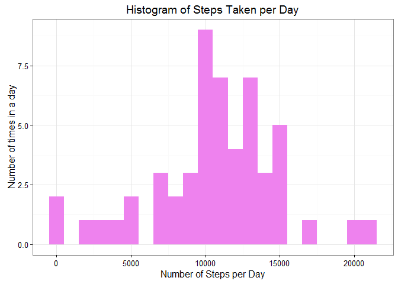
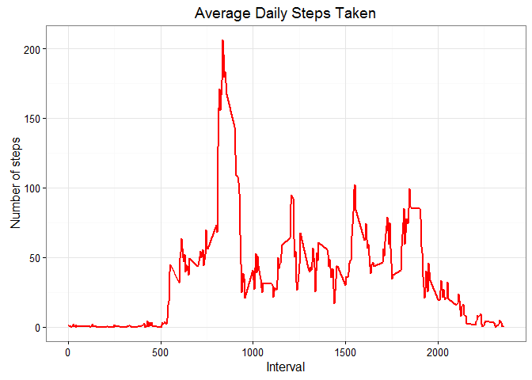
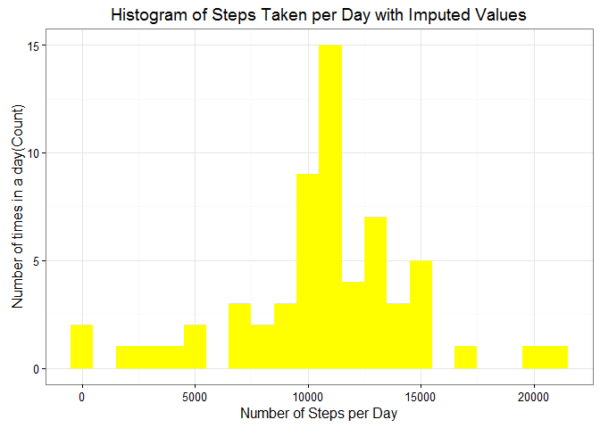
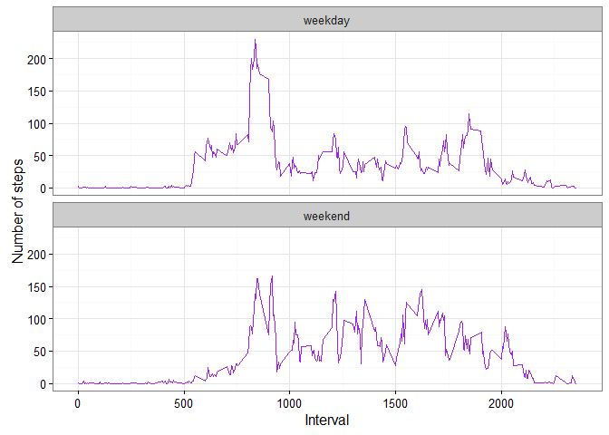

# Reproducible Research: Peer Assessment 1


##Introduction

###This report forms part of the Reproducible Research course on Coursera. It presents an analysis on personal activity monitoring data. For more information, please see the README.


## Loading Requisite Libraries


```r
library(knitr)
opts_chunk$set(echo = TRUE, results = 'hold')
library(data.table)
library(ggplot2) 
```
## Loading and preprocessing the data

```r
filename<-"activity.zip"
   if (!file.exists(filename)){
      fileURL<- "https://d396qusza40orc.cloudfront.net/repdata%2Fdata%2Factivity.zip"
      download.file(fileURL, filename)
      }
   if (!file.exists("activity.csv")){
      unzip(filename)
}
   activity<-read.csv('activity.csv', header = TRUE, sep = ",",
                     colClasses=c("numeric", "character", "numeric"))
   activity$date <- as.Date(activity$date, format = "%Y-%m-%d")
   activity$interval <- as.factor(activity$interval)
```
## What is mean total number of steps taken per day?
### Calculating the total steps per day.

```r
   stepsPerDay <- aggregate(steps ~ date, activity, sum)
   colnames(stepsPerDay) <- c("date","steps")
   head(stepsPerDay)
```

```
## <div class="kable-table">
## 
## date          steps
## -----------  ------
## 2012-10-02      126
## 2012-10-03    11352
## 2012-10-04    12116
## 2012-10-05    13294
## 2012-10-06    15420
## 2012-10-07    11015
## 
## </div>
```
###Generating the histogram to find the total steps taken per day


```r
   ggplot(stepsPerDay, aes(x = steps)) + 
       geom_histogram(fill = "violet", binwidth = 1000) + 
        labs(title="Histogram of Steps Taken per Day", 
             x = "Number of Steps per Day", y = "Number of times in a day") + theme_bw()
```

<!-- -->


## Calculation of the mean steps taken per day

```r
   stepsMean   <- mean(stepsPerDay$steps, na.rm=TRUE)
   stepsMedian <- median(stepsPerDay$steps, na.rm=TRUE)
   paste0("The mean is " ,stepsMean, "  and median is   ",stepsMedian)
```

```
## [1] "The mean is 10766.1886792453  and median is   10765"
```


## What is the average daily activity pattern?

```r
   stepsPerInterval <- aggregate(activity$steps, 
                                by = list(interval = activity$interval),
                                FUN=mean, na.rm=TRUE)
   stepsPerInterval$interval <- 
        as.integer(levels(stepsPerInterval$interval)[stepsPerInterval$interval])
   colnames(stepsPerInterval) <- c("interval", "steps")
```
### Plotting the average across all days of Steps taken against 5 minute intervals of time 

```r
   ggplot(stepsPerInterval, aes(x=interval, y=steps)) +   
        geom_line(color="red", size=1) +  
        labs(title="Average Daily Steps Taken", x="Interval", y="Number of steps") +  
        theme_bw()
```

<!-- -->


## Calculating Interval with the Maximum Steps


```r
   maxInt <- stepsPerInterval[which.max(  
        stepsPerInterval$steps),]
   paste0("The ", maxInt[,1], "th interval has maximum ", maxInt[,2], " steps. ")
```

```
## [1] "The 835th interval has maximum 206.169811320755 steps. "
```


## Imputing missing values

```r
   misVals <- sum(is.na(activity$steps))
```

```r
na_fill <- function(data, pervalue) {
        na_index <- which(is.na(data$steps))
        na_replace <- unlist(lapply(na_index, FUN=function(idx){
                interval = data[idx,]$interval
                pervalue[pervalue$interval == interval,]$steps
        }))
        fill_steps <- data$steps
        fill_steps[na_index] <- na_replace
        fill_steps
}

activity_fill <- data.frame(  
        steps = na_fill(activity, stepsPerInterval),  
        date = activity$date,  
        interval = activity$interval)
str(activity_fill)
```

```
## 'data.frame':	17568 obs. of  3 variables:
##  $ steps   : num  1.717 0.3396 0.1321 0.1509 0.0755 ...
##  $ date    : Date, format: "2012-10-01" "2012-10-01" ...
##  $ interval: Factor w/ 288 levels "0","5","10","15",..: 1 2 3 4 5 6 7 8 9 10 ...
```
### To check the success of filling missing values

```r
sum(is.na(activity_fill$steps))
```

```
## [1] 0
```
### Zero output shows that there are NO MISSING VALUES.
## Plotting graph with the Imputed Values

```r
fill_stepsPerDay <- aggregate(steps ~ date, activity_fill, sum)
colnames(fill_stepsPerDay) <- c("date","steps")

##plotting the histogram
ggplot(fill_stepsPerDay, aes(x = steps)) + 
       geom_histogram(fill = "yellow", binwidth = 1000) + 
        labs(title="Histogram of Steps Taken per Day with Imputed Values", 
             x = "Number of Steps per Day", y = "Number of times in a day(Count)") + theme_bw() 
```

<!-- -->


##Calculating and reporting the mean and median total number of steps taken per day.

```r
steps_meanFill   <- mean(fill_stepsPerDay$steps, na.rm=TRUE)
steps_medianFill <- median(fill_stepsPerDay$steps, na.rm=TRUE)
```
The mean is print(steps_meanFill) and median is print(steps_medianFill).

### Do these values differ from the estimates from the first part of the assignment? 
#### Yes the two values dffer after Imputing

###What is the impact of imputing missing data on the estimates of the total daily number of steps?
####The mean and median post Imputing are now equal, the height of the peak has increased without affecting the predictions

## Are there differences in activity patterns between weekdays and weekends?

```r
wkdaystps <- function(data) {
    wkdaystps <- aggregate(data$steps, by=list(interval = data$interval),
                          FUN=mean, na.rm=T)
    wkdaystps$interval <- 
            as.integer(levels(wkdaystps$interval)[wkdaystps$interval])
    colnames(wkdaystps) <- c("interval", "steps")
    wkdaystps
}

datBywkdays <- function(data) {
    data$weekday <- 
            as.factor(weekdays(data$date)) # weekdays
    wkendDat <- subset(data, weekday %in% c("Saturday","Sunday"))
    wkdayDat <- subset(data, !weekday %in% c("Saturday","Sunday"))

    wkendstps <- wkdaystps(wkendDat)
    wkdaystps <- wkdaystps(wkdayDat)

    wkendstps$dayofweek <- rep("weekend", nrow(wkendstps))
    wkdaystps$dayofweek <- rep("weekday", nrow(wkdaystps))

    datBywkdays <- rbind(wkendstps, wkdaystps)
    datBywkdays$dayofweek <- as.factor(datBywkdays$dayofweek)
    datBywkdays
}

datwkdays <- datBywkdays(activity_fill)
```
##Plotting of the Graph

```r
ggplot(datwkdays, aes(x=interval, y=steps)) + 
        geom_line(color="purple") + 
        facet_wrap(~ dayofweek, nrow=2, ncol=1) +
        labs(x="Interval", y="Number of steps") +
        theme_bw()
```

<!-- -->


###The plot shows more even activities spread during weekend across most time intervals as compared to varying activity pattern during weekdays. Most of the weekdays activity  being below 100 steps for major period of interval.
